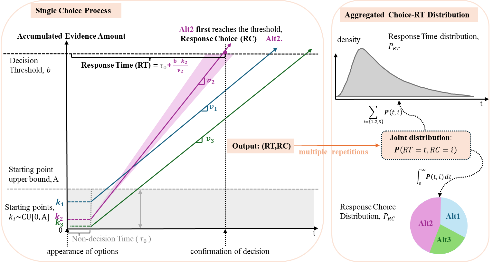

# 1. Introduction
This repository provides all codes and data used in paper _The importance of Response Time in Preference Elicitation: Asymptotic Results_. It includes C++ implementations of MLBA components and R Markdown workflows for estimation and data generation.
> [!NOTE]
> **ABSTRACT**
>
> Response Time (RT) is readily available in computer-based discrete choice experiments, yet it is rarely incorporated into preference models due to the lack of theoretical justification for its benefits. Since evidence accumulation models (EAMs) can jointly model choice and RT, and their constrained specifications are equivalent to workhorse utility-based models, we use them to demonstrate the importance of leveraging RT data in preference elicitation. This study makes two key contributions. First, by contextualizing the asymptotic theory for an EAM, we theoretically show that joint choice-RT (CRT) distribution leads to lower standard errors than the choice-only counterpart. Thus, integrating RT into preference elicitation reduces sample-size requirements. Second, we propose a novel estimation procedure that leverages RT information by modeling the conditional distribution of choice given RT (RTG). The theoretical properties and performance of the proposed RTG estimator are evaluated in a Monte Carlo and an empirical study using frequentist and Bayesian approaches. Comparing CRT, RTG, and choice-only estimators, we find that RTG improves choice prediction accuracy, while CRT remains the most efficient estimator. With theoretical evidence and practical guidance on estimator selection, this study makes a strong case for incorporating RT into choice models to enhance prediction accuracy and estimation efficiency.

<picture>
  
</picture>

# 2. Repository Structure
├── MLBA.cpp
├── MLBARCT_estimation.Rmd
├── MLBARCT_estimation_COadj.Rmd
├── MLBARCT_estimation_hancock.Rmd
├── MLBARCT_recoery_dataset_generation.Rmd


# 3. Quick start

## 1) Clone
```bash
git clone https://github.com/LxinWeixL/Multi-attribute-Linear-Ballistic-Accumulator-Model.git
cd Multi-attribute-Linear-Ballistic-Accumulator-Model
```

## 2) Requirements

R (≥ 4.3 recommended), rmarkdown, knitr are need to open the .Rmd files without error. 
Rcpp and a C/C++ toolchain (Rtools on Windows; Xcode CLT on macOS; build-essential on Linux) are necessary for the .rmarkdown files.  Please open the .Rmd and check the first code chunk for the exact package list.

